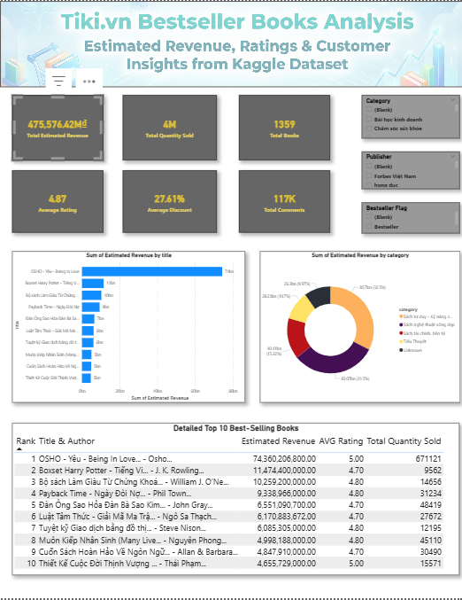

# Tiki.vn Books Sales Analysis

## 📌 Project Overview
This project analyzes book sales data from Tiki.vn using a Kaggle dataset.
The goal is to practice data profiling, cleaning, and building a clear business-focused dashboard.

## 🗂 Dataset
- Source: Kaggle – Tiki Books Dataset  
- Link: https://www.kaggle.com/datasets/biminhc/tiki-books-dataset  
- Description: Book product data from Tiki.vn, including price, rating, sold quantity, and category information.

⚠️ Note: The raw dataset is not included in this repository due to file size limitations.

## 🔧 Tools & Skills
- SQL (profiling, cleaning)
- Power BI (DAX basics, KPI cards, slicers, charts)
- Data visualization & KPI design

## 🔄 Workflow
1. Data profiling using SQL
2. Data cleaning & transformation
3. Create cleaned views for visualization
4. Build Power BI dashboard

## 📊 Dashboard Preview

## 🔁 Reproducibility
To reproduce this analysis:
1. Download the dataset from Kaggle
2. Run SQL scripts in the `sql/` folder
3. Open the Power BI file in `powerbi/`

